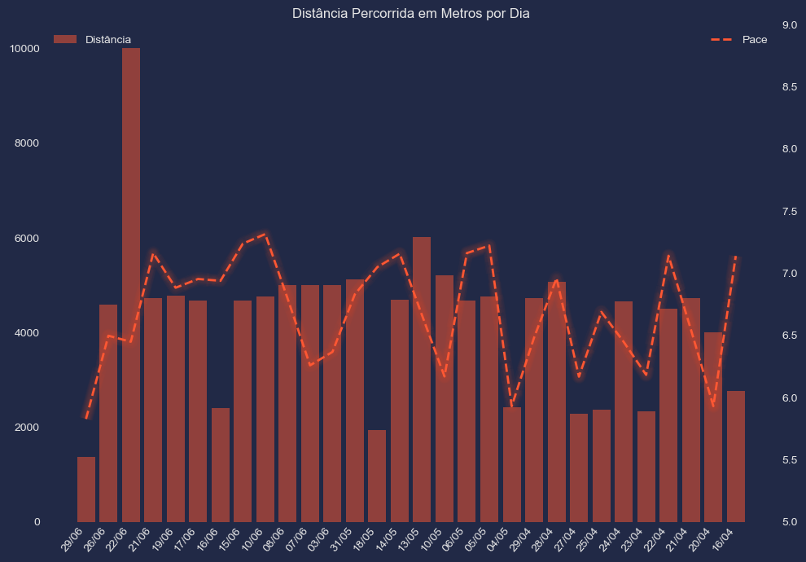

```python
import requests
import pandas as pd
import matplotlib.pyplot as plt
from tabulate import tabulate
import numpy as np
import mplcyberpunk

# URL da API do Strava com o token de acesso na própria URL
activities_url = "https://www.strava.com/api/v3/athlete/activities?access_token=a0c22b45d8f42e73fbd841f98d9ab882d1cc0e8b"

```


```python
# Realiza a requisição GET para obter as atividades do atleta
response = requests.get(activities_url)

```


```python
# Verifica se a requisição foi bem-sucedida (código de status 200)
if response.status_code == 200:
    # Converte a resposta JSON para um DataFrame do pandas
    df = pd.json_normalize(response.json())
    
    # Exibir primeiras linhas
    print(df.head(10)) 

    
```

       resource_state                                    name  distance  \
    0               2  Comecou a chover no meio do percurso 🥲    1378.4   
    1               2                   Corrida ao entardecer    4582.5   
    2               2                      Corrida vespertina   10001.1   
    3               2                         Corrida noturna    4722.0   
    4               2                   Corrida ao entardecer    4785.8   
    5               2                   Corrida ao entardecer    4666.7   
    6               2               Corrida na hora do almoço    2408.2   
    7               2                      Corrida vespertina    4670.1   
    8               2                   Corrida ao entardecer    4761.6   
    9               2               Corrida na hora do almoço    5002.0   
    
       moving_time  elapsed_time  total_elevation_gain type sport_type  \
    0          482           482                   2.9  Run        Run   
    1         1758          1758                  12.6  Run        Run   
    2         3748          3748                  23.6  Run        Run   
    3         1946          1949                  11.8  Run        Run   
    4         1870          1934                  11.8  Run        Run   
    5         1826          1829                  11.8  Run        Run   
    6          934           934                   5.9  Run        Run   
    7         1889          1889                  11.8  Run        Run   
    8         1948          1948                  11.8  Run        Run   
    9         1897          1900                   0.0  Run        Run   
    
       workout_type           id  ...  \
    0             0  11770868530  ...   
    1             0  11747838693  ...   
    2             0  11715002282  ...   
    3             0  11708010403  ...   
    4             0  11693216527  ...   
    5             0  11676792679  ...   
    6             0  11667179251  ...   
    7             0  11660691982  ...   
    8             0  11622765090  ...   
    9             0  11604870223  ...   
    
                                             external_id from_accepted_tag  \
    0  stripped_A0944BF5-4D64-4C00-BCFD-D6CDBAB7F21C-...             False   
    1  stripped_4F5AB420-06C7-4EF3-8F48-847E39F0F88D-...             False   
    2  stripped_6EE70FBF-F06A-4D6B-8732-8012A66BED44-...             False   
    3  stripped_566F9FE9-2391-40E1-B5EA-ECDE44351048-...             False   
    4  stripped_74407DBD-AA08-4CBD-A636-B7A1A3D472B8-...             False   
    5  stripped_DCE09D8E-9F05-48C9-BDA0-DB9A575F736D-...             False   
    6  stripped_95A9DE7D-3D17-4880-8C18-334A5EA5BD62-...             False   
    7  stripped_C409F232-766A-4B4E-B781-ED50A30DBABA-...             False   
    8  stripped_0D7A576F-B9AE-4386-BEE8-233CE9FEC39F-...             False   
    9  stripped_51144613-136F-4568-AA0F-2C37C0281B72-...             False   
    
      pr_count  total_photo_count has_kudoed athlete.id athlete.resource_state  \
    0        0                  0      False   63580438                      1   
    1        0                  0      False   63580438                      1   
    2        0                  0      False   63580438                      1   
    3        0                  0      False   63580438                      1   
    4        0                  0      False   63580438                      1   
    5        0                  0      False   63580438                      1   
    6        0                  0      False   63580438                      1   
    7        0                  0      False   63580438                      1   
    8        0                  0      False   63580438                      1   
    9        0                  0      False   63580438                      1   
    
             map.id                               map.summary_polyline  \
    0  a11770868530                                                      
    1  a11747838693                                                      
    2  a11715002282                                                      
    3  a11708010403                                                      
    4  a11693216527                                                      
    5  a11676792679                                                      
    6  a11667179251                                                      
    7  a11660691982                                                      
    8  a11622765090                                                      
    9  a11604870223  dafkCbr_eGA\SjBI`ACx@Ir@Ap@IrACvAEj@Ih@Cf@ERCp...   
    
       map.resource_state  
    0                   2  
    1                   2  
    2                   2  
    3                   2  
    4                   2  
    5                   2  
    6                   2  
    7                   2  
    8                   2  
    9                   2  
    
    [10 rows x 50 columns]
    


```python
# Ordena o DataFrame pelas maiores distâncias (do maior para o menor)
df_sorted = df.sort_values(by='distance', ascending=False)
    
# Exibe o DataFrame ordenado como uma tabela formatada
print(df_sorted[['name', 'distance']])

print(df)
```

                                          name  distance
    2                       Corrida vespertina   10001.1
    15                   Corrida ao entardecer    6020.2
    16                      Corrida vespertina    5206.5
    12               Corrida na hora do almoço    5119.1
    21                   Corrida ao entardecer    5076.4
    11                   Corrida ao entardecer    5003.4
    10                   Corrida ao entardecer    5003.1
    9                Corrida na hora do almoço    5002.0
    4                    Corrida ao entardecer    4785.8
    18                   Corrida ao entardecer    4767.2
    8                    Corrida ao entardecer    4761.6
    20                         Corrida noturna    4732.6
    27                         Corrida noturna    4732.2
    3                          Corrida noturna    4722.0
    14                   Corrida ao entardecer    4692.5
    17                   Corrida ao entardecer    4679.1
    7                       Corrida vespertina    4670.1
    5                    Corrida ao entardecer    4666.7
    24                         Corrida noturna    4665.6
    1                    Corrida ao entardecer    4582.5
    26                   Corrida ao entardecer    4494.6
    28               Corrida na hora do almoço    4007.2
    29                         Corrida noturna    2768.0
    19                         Corrida matinal    2425.0
    6                Corrida na hora do almoço    2408.2
    23                         Corrida noturna    2363.2
    25                      Corrida vespertina    2327.8
    22                   Corrida ao entardecer    2275.4
    13                         Corrida noturna    1932.9
    0   Comecou a chover no meio do percurso 🥲    1378.4
        resource_state                                    name  distance  \
    0                2  Comecou a chover no meio do percurso 🥲    1378.4   
    1                2                   Corrida ao entardecer    4582.5   
    2                2                      Corrida vespertina   10001.1   
    3                2                         Corrida noturna    4722.0   
    4                2                   Corrida ao entardecer    4785.8   
    5                2                   Corrida ao entardecer    4666.7   
    6                2               Corrida na hora do almoço    2408.2   
    7                2                      Corrida vespertina    4670.1   
    8                2                   Corrida ao entardecer    4761.6   
    9                2               Corrida na hora do almoço    5002.0   
    10               2                   Corrida ao entardecer    5003.1   
    11               2                   Corrida ao entardecer    5003.4   
    12               2               Corrida na hora do almoço    5119.1   
    13               2                         Corrida noturna    1932.9   
    14               2                   Corrida ao entardecer    4692.5   
    15               2                   Corrida ao entardecer    6020.2   
    16               2                      Corrida vespertina    5206.5   
    17               2                   Corrida ao entardecer    4679.1   
    18               2                   Corrida ao entardecer    4767.2   
    19               2                         Corrida matinal    2425.0   
    20               2                         Corrida noturna    4732.6   
    21               2                   Corrida ao entardecer    5076.4   
    22               2                   Corrida ao entardecer    2275.4   
    23               2                         Corrida noturna    2363.2   
    24               2                         Corrida noturna    4665.6   
    25               2                      Corrida vespertina    2327.8   
    26               2                   Corrida ao entardecer    4494.6   
    27               2                         Corrida noturna    4732.2   
    28               2               Corrida na hora do almoço    4007.2   
    29               2                         Corrida noturna    2768.0   
    
        moving_time  elapsed_time  total_elevation_gain type sport_type  \
    0           482           482                   2.9  Run        Run   
    1          1758          1758                  12.6  Run        Run   
    2          3748          3748                  23.6  Run        Run   
    3          1946          1949                  11.8  Run        Run   
    4          1870          1934                  11.8  Run        Run   
    5          1826          1829                  11.8  Run        Run   
    6           934           934                   5.9  Run        Run   
    7          1889          1889                  11.8  Run        Run   
    8          1948          1948                  11.8  Run        Run   
    9          1897          1900                   0.0  Run        Run   
    10         1749          1749                  11.8  Run        Run   
    11         1800          1800                  11.8  Run        Run   
    12         2008          2011                   2.6  Run        Run   
    13          794           798                   4.9  Run        Run   
    14         1986          1998                  11.8  Run        Run   
    15         2406          2661                  14.5  Run        Run   
    16         1960          1960                  11.8  Run        Run   
    17         2068          2077                  11.8  Run        Run   
    18         2150          2257                  11.8  Run        Run   
    19          917           920                   5.9  Run        Run   
    20         1964          1988                  11.8  Run        Run   
    21         2265          2518                  11.8  Run        Run   
    22          910           916                   0.0  Run        Run   
    23         1019          1023                   5.9  Run        Run   
    24         1938          1944                  11.8  Run        Run   
    25          924           924                   5.9  Run        Run   
    26         2026          2071                  11.7  Run        Run   
    27         1942          1951                  11.8  Run        Run   
    28         1475          1482                   0.0  Run        Run   
    29         1203          1429                   5.9  Run        Run   
    
        workout_type           id  ...  \
    0              0  11770868530  ...   
    1              0  11747838693  ...   
    2              0  11715002282  ...   
    3              0  11708010403  ...   
    4              0  11693216527  ...   
    5              0  11676792679  ...   
    6              0  11667179251  ...   
    7              0  11660691982  ...   
    8              0  11622765090  ...   
    9              0  11604870223  ...   
    10             0  11598578142  ...   
    11             0  11566783025  ...   
    12             0  11540426209  ...   
    13             0  11443017357  ...   
    14             0  11412508968  ...   
    15             0  11403985364  ...   
    16             0  11379792578  ...   
    17             0  11348908801  ...   
    18             0  11341967523  ...   
    19             0  11329980023  ...   
    20             0  11294989100  ...   
    21             0  11287491868  ...   
    22             0  11278518889  ...   
    23             3  11257926124  ...   
    24             0  11250544699  ...   
    25             0  11247452268  ...   
    26             0  11242247960  ...   
    27             0  11235692635  ...   
    28             0  11225128237  ...   
    29             0  11191499223  ...   
    
                                              external_id from_accepted_tag  \
    0   stripped_A0944BF5-4D64-4C00-BCFD-D6CDBAB7F21C-...             False   
    1   stripped_4F5AB420-06C7-4EF3-8F48-847E39F0F88D-...             False   
    2   stripped_6EE70FBF-F06A-4D6B-8732-8012A66BED44-...             False   
    3   stripped_566F9FE9-2391-40E1-B5EA-ECDE44351048-...             False   
    4   stripped_74407DBD-AA08-4CBD-A636-B7A1A3D472B8-...             False   
    5   stripped_DCE09D8E-9F05-48C9-BDA0-DB9A575F736D-...             False   
    6   stripped_95A9DE7D-3D17-4880-8C18-334A5EA5BD62-...             False   
    7   stripped_C409F232-766A-4B4E-B781-ED50A30DBABA-...             False   
    8   stripped_0D7A576F-B9AE-4386-BEE8-233CE9FEC39F-...             False   
    9   stripped_51144613-136F-4568-AA0F-2C37C0281B72-...             False   
    10  stripped_C4E36692-DDDE-4B4E-9C95-61899E1DCD4E-...             False   
    11  stripped_19A136D5-A82E-4A0D-A5F2-508A75E752F2-...             False   
    12  stripped_A64CD32A-BBA7-4966-B563-84B87DFA2A8F-...             False   
    13  stripped_CF977A0C-9497-471D-912F-057DFCACFAF0-...             False   
    14  stripped_28CCFBDA-22B0-4862-82AE-010A7BC01A1F-...             False   
    15  stripped_B09BFC08-9C32-4CD6-890E-81069A4FF890-...             False   
    16  stripped_F01CA775-8952-46D6-9B7A-F9FDBB076E60-...             False   
    17  stripped_2376AF58-DF72-4BEB-AB21-399B05352F1A-...             False   
    18  stripped_CC07004A-BAAC-4CFC-B404-1466BC26F483-...             False   
    19  stripped_30606978-92D4-4D5D-BAB0-9C2B94AACA3C-...             False   
    20  stripped_0CFF49BB-746D-438A-B758-903039EEAB55-...             False   
    21  stripped_29AB5CC8-44F7-4BC9-A0B3-69165AC72A87-...             False   
    22  stripped_86A9938E-99AD-4E50-8F13-824CEA5F49C7-...             False   
    23  stripped_074719ED-9D1F-4B26-97AE-56BEE828F6AC-...             False   
    24  stripped_047AD8A3-587D-4A0E-8C38-DECDB067D3B3-...             False   
    25  stripped_4FA49FF8-777D-42CD-97F5-D17958EAF0C1-...             False   
    26  stripped_396A9EC8-5C55-44F4-AE5D-AA2955F1DE79-...             False   
    27  stripped_14A56A2D-C330-4758-9267-FB5F5D177E03-...             False   
    28  stripped_7E383880-F15C-49C9-BF5F-A9D19CA1F51E-...             False   
    29       stripped_health_data_63580438_1713227072.fit             False   
    
       pr_count  total_photo_count has_kudoed athlete.id athlete.resource_state  \
    0         0                  0      False   63580438                      1   
    1         0                  0      False   63580438                      1   
    2         0                  0      False   63580438                      1   
    3         0                  0      False   63580438                      1   
    4         0                  0      False   63580438                      1   
    5         0                  0      False   63580438                      1   
    6         0                  0      False   63580438                      1   
    7         0                  0      False   63580438                      1   
    8         0                  0      False   63580438                      1   
    9         0                  0      False   63580438                      1   
    10        1                  0      False   63580438                      1   
    11        0                  0      False   63580438                      1   
    12        0                  0      False   63580438                      1   
    13        0                  0      False   63580438                      1   
    14        0                  0      False   63580438                      1   
    15        0                  0      False   63580438                      1   
    16        0                  0      False   63580438                      1   
    17        0                  0      False   63580438                      1   
    18        0                  0      False   63580438                      1   
    19        0                  0      False   63580438                      1   
    20        0                  0      False   63580438                      1   
    21        0                  0      False   63580438                      1   
    22        0                  0      False   63580438                      1   
    23        0                  0      False   63580438                      1   
    24        0                  0      False   63580438                      1   
    25        0                  0      False   63580438                      1   
    26        0                  0      False   63580438                      1   
    27        0                  0      False   63580438                      1   
    28        0                  0      False   63580438                      1   
    29        0                  0      False   63580438                      1   
    
              map.id                               map.summary_polyline  \
    0   a11770868530                                                      
    1   a11747838693                                                      
    2   a11715002282                                                      
    3   a11708010403                                                      
    4   a11693216527                                                      
    5   a11676792679                                                      
    6   a11667179251                                                      
    7   a11660691982                                                      
    8   a11622765090                                                      
    9   a11604870223  dafkCbr_eGA\SjBI`ACx@Ir@Ap@IrACvAEj@Ih@Cf@ERCp...   
    10  a11598578142                                                      
    11  a11566783025                                                      
    12  a11540426209                                                      
    13  a11443017357                                                      
    14  a11412508968                                                      
    15  a11403985364  nc}jCjyqdG?SEq@Gq@Ga@Bg@EUOwCJwAT_AP]D[NYJ_@AY...   
    16  a11379792578  tc}jCnyqdGF]EMBOESBKCE@ECUGQAKB_@CMDOMo@@a@Ou@...   
    17  a11348908801  lc}jC|yqdGUyCB_@?_@Ge@EO@IKw@Ak@Ds@Ny@FM`@_B\u...   
    18  a11341967523  |b}jCntqdG?IAK@SCM?WIUAa@@a@CaAj@kDJOBQZm@Ma@O...   
    19  a11329980023  tc}jClyqdGGc@B_AI]BKKW?ODa@IU?QO}@@a@C_@J_ARq@...   
    20  a11294989100  rc}jC|zqdGNm@CUCACK?QBKIo@Ac@EOEo@Kg@BEE[DYE]@...   
    21  a11287491868  fc}jCjzqdG?OEe@?w@KcAAu@Gy@CsBD}@PkAz@wBG_@QO[...   
    22  a11278518889  xhekClnfeGGtA@~@ELE`A@XCNBREbA@`@CH?JEv@DNEJ?n...   
    23  a11257926124  zc}jCjxqdGEU@SC_@CGC]GY@g@KkA@MG]DSC[A_@Lo@Da@...   
    24  a11250544699  tc}jCxyqdG@SEaAEG?YG_@?[Kw@I{@@ECUFYEQD{@?YJq@...   
    25  a11247452268  pc}jCpyqdGEw@?WCSAe@GSBYSuBCg@BUC[HcAR}@L_@JQP...   
    26  a11242247960  tb}jCpqqdGK_BBi@LsAHe@FWr@iBGa@KKUAmBJUDy@Ba@D...   
    27  a11235692635  tc}jChyqdGGo@@I?OGUEi@BWCUBCEWIw@?c@CW@KCSBSCQ...   
    28  a11225128237  dcekCnmkeG?c@BW?_@Cq@?yCC_@@gAEcA@m@AmBBo@AYL_...   
    29  a11191499223  xc}jCtxqdGKaA?_@CQAk@Gk@KkDH}@Pu@@QFWr@}A@IEOE...   
    
        map.resource_state  
    0                    2  
    1                    2  
    2                    2  
    3                    2  
    4                    2  
    5                    2  
    6                    2  
    7                    2  
    8                    2  
    9                    2  
    10                   2  
    11                   2  
    12                   2  
    13                   2  
    14                   2  
    15                   2  
    16                   2  
    17                   2  
    18                   2  
    19                   2  
    20                   2  
    21                   2  
    22                   2  
    23                   2  
    24                   2  
    25                   2  
    26                   2  
    27                   2  
    28                   2  
    29                   2  
    
    [30 rows x 50 columns]
    


```python
# Verifica se a requisição foi bem-sucedida (código de status 200)
if response.status_code == 200:
    # Converte a resposta JSON para um DataFrame do pandas
    activities_data = response.json()
    df = pd.json_normalize(activities_data)
    
    # Ordena o DataFrame pelas maiores distâncias (do maior para o menor)
    df_sorted = df.sort_values(by='distance', ascending=False)
    
    # Adiciona uma coluna de ranking baseada na distância
    df_sorted['ranking'] = df_sorted['distance'].rank(ascending=False, method='dense')
    
    # Seleciona as top 10 atividades
    top_10 = df_sorted.head(10)
    
    # Exibe as top 10 atividades com ranking, nome e distância
    print(top_10[['ranking', 'name', 'distance']])

```

        ranking                       name  distance
    2       1.0         Corrida vespertina   10001.1
    15      2.0      Corrida ao entardecer    6020.2
    16      3.0         Corrida vespertina    5206.5
    12      4.0  Corrida na hora do almoço    5119.1
    21      5.0      Corrida ao entardecer    5076.4
    11      6.0      Corrida ao entardecer    5003.4
    10      7.0      Corrida ao entardecer    5003.1
    9       8.0  Corrida na hora do almoço    5002.0
    4       9.0      Corrida ao entardecer    4785.8
    18     10.0      Corrida ao entardecer    4767.2
    


```python
# Verifica se a requisição foi bem-sucedida (código de status 200)
if response.status_code == 200:
    # Converte a resposta JSON para um DataFrame do pandas
    activities_data = response.json()
    df = pd.json_normalize(activities_data)
    
    # Filtra a linha onde a distância é igual a 10001.1
    atividade_especifica = df[df['distance'] == 10001.1]
    
    # Exibe a linha específica como tabela formatada
    if not atividade_especifica.empty:
        print(atividade_especifica[['name', 'distance']])
    else:
        print("Nenhuma atividade encontrada com a distância especificada.")
```

                     name  distance
    2  Corrida vespertina   10001.1
    


```python
# Verifica se a requisição foi bem-sucedida (código de status 200)
if response.status_code == 200:
    # Converte a resposta JSON para um DataFrame do pandas
    activities_data = response.json()
    df = pd.json_normalize(activities_data)
    
    # Filtra a linha onde a distância é igual a 10001.1
    atividade_especifica = df[df['distance'] == 10001.1]
    
    # Exibe a linha específica como tabela formatada
    if not atividade_especifica.empty:
        print(atividade_especifica[['name', 'distance', 'moving_time', 'average_speed']].to_string(index=False))
    else:
        print("Nenhuma atividade encontrada com a distância especificada.")

```

                  name  distance  moving_time  average_speed
    Corrida vespertina   10001.1         3748          2.668
    


```python
import pandas as pd

# Supondo que você já tenha feito as importações necessárias e tenha uma resposta JSON válida

# Verifica se a requisição foi bem-sucedida (código de status 200)
if response.status_code == 200:
    # Converte a resposta JSON para um DataFrame do pandas
    activities_data = response.json()
    df = pd.json_normalize(activities_data)
    
    # Converter moving_time para horas (de minutos para horas)
    df['moving_time_hours'] = df['moving_time'] / 60.0  # 60 minutos em uma hora
    
    # Calcular o ritmo (pace) em km/h
    df['pace_certo'] = (df['moving_time_hours']) / (df['distance'] / 1000)  # distance convertido para quilômetros
    
print(df)
```

        resource_state                                    name  distance  \
    0                2  Comecou a chover no meio do percurso 🥲    1378.4   
    1                2                   Corrida ao entardecer    4582.5   
    2                2                      Corrida vespertina   10001.1   
    3                2                         Corrida noturna    4722.0   
    4                2                   Corrida ao entardecer    4785.8   
    5                2                   Corrida ao entardecer    4666.7   
    6                2               Corrida na hora do almoço    2408.2   
    7                2                      Corrida vespertina    4670.1   
    8                2                   Corrida ao entardecer    4761.6   
    9                2               Corrida na hora do almoço    5002.0   
    10               2                   Corrida ao entardecer    5003.1   
    11               2                   Corrida ao entardecer    5003.4   
    12               2               Corrida na hora do almoço    5119.1   
    13               2                         Corrida noturna    1932.9   
    14               2                   Corrida ao entardecer    4692.5   
    15               2                   Corrida ao entardecer    6020.2   
    16               2                      Corrida vespertina    5206.5   
    17               2                   Corrida ao entardecer    4679.1   
    18               2                   Corrida ao entardecer    4767.2   
    19               2                         Corrida matinal    2425.0   
    20               2                         Corrida noturna    4732.6   
    21               2                   Corrida ao entardecer    5076.4   
    22               2                   Corrida ao entardecer    2275.4   
    23               2                         Corrida noturna    2363.2   
    24               2                         Corrida noturna    4665.6   
    25               2                      Corrida vespertina    2327.8   
    26               2                   Corrida ao entardecer    4494.6   
    27               2                         Corrida noturna    4732.2   
    28               2               Corrida na hora do almoço    4007.2   
    29               2                         Corrida noturna    2768.0   
    
        moving_time  elapsed_time  total_elevation_gain type sport_type  \
    0           482           482                   2.9  Run        Run   
    1          1758          1758                  12.6  Run        Run   
    2          3748          3748                  23.6  Run        Run   
    3          1946          1949                  11.8  Run        Run   
    4          1870          1934                  11.8  Run        Run   
    5          1826          1829                  11.8  Run        Run   
    6           934           934                   5.9  Run        Run   
    7          1889          1889                  11.8  Run        Run   
    8          1948          1948                  11.8  Run        Run   
    9          1897          1900                   0.0  Run        Run   
    10         1749          1749                  11.8  Run        Run   
    11         1800          1800                  11.8  Run        Run   
    12         2008          2011                   2.6  Run        Run   
    13          794           798                   4.9  Run        Run   
    14         1986          1998                  11.8  Run        Run   
    15         2406          2661                  14.5  Run        Run   
    16         1960          1960                  11.8  Run        Run   
    17         2068          2077                  11.8  Run        Run   
    18         2150          2257                  11.8  Run        Run   
    19          917           920                   5.9  Run        Run   
    20         1964          1988                  11.8  Run        Run   
    21         2265          2518                  11.8  Run        Run   
    22          910           916                   0.0  Run        Run   
    23         1019          1023                   5.9  Run        Run   
    24         1938          1944                  11.8  Run        Run   
    25          924           924                   5.9  Run        Run   
    26         2026          2071                  11.7  Run        Run   
    27         1942          1951                  11.8  Run        Run   
    28         1475          1482                   0.0  Run        Run   
    29         1203          1429                   5.9  Run        Run   
    
        workout_type           id  ... pr_count total_photo_count has_kudoed  \
    0              0  11770868530  ...        0                 0      False   
    1              0  11747838693  ...        0                 0      False   
    2              0  11715002282  ...        0                 0      False   
    3              0  11708010403  ...        0                 0      False   
    4              0  11693216527  ...        0                 0      False   
    5              0  11676792679  ...        0                 0      False   
    6              0  11667179251  ...        0                 0      False   
    7              0  11660691982  ...        0                 0      False   
    8              0  11622765090  ...        0                 0      False   
    9              0  11604870223  ...        0                 0      False   
    10             0  11598578142  ...        1                 0      False   
    11             0  11566783025  ...        0                 0      False   
    12             0  11540426209  ...        0                 0      False   
    13             0  11443017357  ...        0                 0      False   
    14             0  11412508968  ...        0                 0      False   
    15             0  11403985364  ...        0                 0      False   
    16             0  11379792578  ...        0                 0      False   
    17             0  11348908801  ...        0                 0      False   
    18             0  11341967523  ...        0                 0      False   
    19             0  11329980023  ...        0                 0      False   
    20             0  11294989100  ...        0                 0      False   
    21             0  11287491868  ...        0                 0      False   
    22             0  11278518889  ...        0                 0      False   
    23             3  11257926124  ...        0                 0      False   
    24             0  11250544699  ...        0                 0      False   
    25             0  11247452268  ...        0                 0      False   
    26             0  11242247960  ...        0                 0      False   
    27             0  11235692635  ...        0                 0      False   
    28             0  11225128237  ...        0                 0      False   
    29             0  11191499223  ...        0                 0      False   
    
        athlete.id athlete.resource_state        map.id  \
    0     63580438                      1  a11770868530   
    1     63580438                      1  a11747838693   
    2     63580438                      1  a11715002282   
    3     63580438                      1  a11708010403   
    4     63580438                      1  a11693216527   
    5     63580438                      1  a11676792679   
    6     63580438                      1  a11667179251   
    7     63580438                      1  a11660691982   
    8     63580438                      1  a11622765090   
    9     63580438                      1  a11604870223   
    10    63580438                      1  a11598578142   
    11    63580438                      1  a11566783025   
    12    63580438                      1  a11540426209   
    13    63580438                      1  a11443017357   
    14    63580438                      1  a11412508968   
    15    63580438                      1  a11403985364   
    16    63580438                      1  a11379792578   
    17    63580438                      1  a11348908801   
    18    63580438                      1  a11341967523   
    19    63580438                      1  a11329980023   
    20    63580438                      1  a11294989100   
    21    63580438                      1  a11287491868   
    22    63580438                      1  a11278518889   
    23    63580438                      1  a11257926124   
    24    63580438                      1  a11250544699   
    25    63580438                      1  a11247452268   
    26    63580438                      1  a11242247960   
    27    63580438                      1  a11235692635   
    28    63580438                      1  a11225128237   
    29    63580438                      1  a11191499223   
    
                                     map.summary_polyline  map.resource_state  \
    0                                                                       2   
    1                                                                       2   
    2                                                                       2   
    3                                                                       2   
    4                                                                       2   
    5                                                                       2   
    6                                                                       2   
    7                                                                       2   
    8                                                                       2   
    9   dafkCbr_eGA\SjBI`ACx@Ir@Ap@IrACvAEj@Ih@Cf@ERCp...                   2   
    10                                                                      2   
    11                                                                      2   
    12                                                                      2   
    13                                                                      2   
    14                                                                      2   
    15  nc}jCjyqdG?SEq@Gq@Ga@Bg@EUOwCJwAT_AP]D[NYJ_@AY...                   2   
    16  tc}jCnyqdGF]EMBOESBKCE@ECUGQAKB_@CMDOMo@@a@Ou@...                   2   
    17  lc}jC|yqdGUyCB_@?_@Ge@EO@IKw@Ak@Ds@Ny@FM`@_B\u...                   2   
    18  |b}jCntqdG?IAK@SCM?WIUAa@@a@CaAj@kDJOBQZm@Ma@O...                   2   
    19  tc}jClyqdGGc@B_AI]BKKW?ODa@IU?QO}@@a@C_@J_ARq@...                   2   
    20  rc}jC|zqdGNm@CUCACK?QBKIo@Ac@EOEo@Kg@BEE[DYE]@...                   2   
    21  fc}jCjzqdG?OEe@?w@KcAAu@Gy@CsBD}@PkAz@wBG_@QO[...                   2   
    22  xhekClnfeGGtA@~@ELE`A@XCNBREbA@`@CH?JEv@DNEJ?n...                   2   
    23  zc}jCjxqdGEU@SC_@CGC]GY@g@KkA@MG]DSC[A_@Lo@Da@...                   2   
    24  tc}jCxyqdG@SEaAEG?YG_@?[Kw@I{@@ECUFYEQD{@?YJq@...                   2   
    25  pc}jCpyqdGEw@?WCSAe@GSBYSuBCg@BUC[HcAR}@L_@JQP...                   2   
    26  tb}jCpqqdGK_BBi@LsAHe@FWr@iBGa@KKUAmBJUDy@Ba@D...                   2   
    27  tc}jChyqdGGo@@I?OGUEi@BWCUBCEWIw@?c@CW@KCSBSCQ...                   2   
    28  dcekCnmkeG?c@BW?_@Cq@?yCC_@@gAEcA@m@AmBBo@AYL_...                   2   
    29  xc}jCtxqdGKaA?_@CQAk@Gk@KkDH}@Pu@@QFWr@}A@IEOE...                   2   
    
        moving_time_hours  pace_certo  
    0            8.033333    5.828013  
    1           29.300000    6.393890  
    2           62.466667    6.245980  
    3           32.433333    6.868559  
    4           31.166667    6.512321  
    5           30.433333    6.521382  
    6           15.566667    6.464026  
    7           31.483333    6.741469  
    8           32.466667    6.818436  
    9           31.616667    6.320805  
    10          29.150000    5.826388  
    11          30.000000    5.995923  
    12          33.466667    6.537608  
    13          13.233333    6.846362  
    14          33.100000    7.053809  
    15          40.100000    6.660908  
    16          32.666667    6.274209  
    17          34.466667    7.366089  
    18          35.833333    7.516641  
    19          15.283333    6.302405  
    20          32.733333    6.916565  
    21          37.750000    7.436372  
    22          15.166667    6.665495  
    23          16.983333    7.186583  
    24          32.300000    6.923011  
    25          15.400000    6.615689  
    26          33.766667    7.512719  
    27          32.366667    6.839666  
    28          24.583333    6.134791  
    29          20.050000    7.243497  
    
    [30 rows x 52 columns]
    


```python
# Exibe o DataFrame com a nova coluna 'pace'
print(df[['name', 'distance', 'moving_time', 'pace_certo']])
    
# Apenas colunas que usaremos
print(df[['name', 'distance', 'moving_time', 'pace_certo', 'start_date']])
```

                                          name  distance  moving_time  pace_certo
    0   Comecou a chover no meio do percurso 🥲    1378.4          482    5.828013
    1                    Corrida ao entardecer    4582.5         1758    6.393890
    2                       Corrida vespertina   10001.1         3748    6.245980
    3                          Corrida noturna    4722.0         1946    6.868559
    4                    Corrida ao entardecer    4785.8         1870    6.512321
    5                    Corrida ao entardecer    4666.7         1826    6.521382
    6                Corrida na hora do almoço    2408.2          934    6.464026
    7                       Corrida vespertina    4670.1         1889    6.741469
    8                    Corrida ao entardecer    4761.6         1948    6.818436
    9                Corrida na hora do almoço    5002.0         1897    6.320805
    10                   Corrida ao entardecer    5003.1         1749    5.826388
    11                   Corrida ao entardecer    5003.4         1800    5.995923
    12               Corrida na hora do almoço    5119.1         2008    6.537608
    13                         Corrida noturna    1932.9          794    6.846362
    14                   Corrida ao entardecer    4692.5         1986    7.053809
    15                   Corrida ao entardecer    6020.2         2406    6.660908
    16                      Corrida vespertina    5206.5         1960    6.274209
    17                   Corrida ao entardecer    4679.1         2068    7.366089
    18                   Corrida ao entardecer    4767.2         2150    7.516641
    19                         Corrida matinal    2425.0          917    6.302405
    20                         Corrida noturna    4732.6         1964    6.916565
    21                   Corrida ao entardecer    5076.4         2265    7.436372
    22                   Corrida ao entardecer    2275.4          910    6.665495
    23                         Corrida noturna    2363.2         1019    7.186583
    24                         Corrida noturna    4665.6         1938    6.923011
    25                      Corrida vespertina    2327.8          924    6.615689
    26                   Corrida ao entardecer    4494.6         2026    7.512719
    27                         Corrida noturna    4732.2         1942    6.839666
    28               Corrida na hora do almoço    4007.2         1475    6.134791
    29                         Corrida noturna    2768.0         1203    7.243497
                                          name  distance  moving_time  pace_certo  \
    0   Comecou a chover no meio do percurso 🥲    1378.4          482    5.828013   
    1                    Corrida ao entardecer    4582.5         1758    6.393890   
    2                       Corrida vespertina   10001.1         3748    6.245980   
    3                          Corrida noturna    4722.0         1946    6.868559   
    4                    Corrida ao entardecer    4785.8         1870    6.512321   
    5                    Corrida ao entardecer    4666.7         1826    6.521382   
    6                Corrida na hora do almoço    2408.2          934    6.464026   
    7                       Corrida vespertina    4670.1         1889    6.741469   
    8                    Corrida ao entardecer    4761.6         1948    6.818436   
    9                Corrida na hora do almoço    5002.0         1897    6.320805   
    10                   Corrida ao entardecer    5003.1         1749    5.826388   
    11                   Corrida ao entardecer    5003.4         1800    5.995923   
    12               Corrida na hora do almoço    5119.1         2008    6.537608   
    13                         Corrida noturna    1932.9          794    6.846362   
    14                   Corrida ao entardecer    4692.5         1986    7.053809   
    15                   Corrida ao entardecer    6020.2         2406    6.660908   
    16                      Corrida vespertina    5206.5         1960    6.274209   
    17                   Corrida ao entardecer    4679.1         2068    7.366089   
    18                   Corrida ao entardecer    4767.2         2150    7.516641   
    19                         Corrida matinal    2425.0          917    6.302405   
    20                         Corrida noturna    4732.6         1964    6.916565   
    21                   Corrida ao entardecer    5076.4         2265    7.436372   
    22                   Corrida ao entardecer    2275.4          910    6.665495   
    23                         Corrida noturna    2363.2         1019    7.186583   
    24                         Corrida noturna    4665.6         1938    6.923011   
    25                      Corrida vespertina    2327.8          924    6.615689   
    26                   Corrida ao entardecer    4494.6         2026    7.512719   
    27                         Corrida noturna    4732.2         1942    6.839666   
    28               Corrida na hora do almoço    4007.2         1475    6.134791   
    29                         Corrida noturna    2768.0         1203    7.243497   
    
                  start_date  
    0   2024-06-29T23:45:14Z  
    1   2024-06-26T21:50:42Z  
    2   2024-06-22T19:30:23Z  
    3   2024-06-21T23:30:25Z  
    4   2024-06-19T22:02:03Z  
    5   2024-06-17T22:18:01Z  
    6   2024-06-16T15:34:08Z  
    7   2024-06-15T19:18:31Z  
    8   2024-06-10T22:42:57Z  
    9   2024-06-08T15:26:49Z  
    10  2024-06-07T21:01:13Z  
    11  2024-06-03T21:38:38Z  
    12  2024-05-31T14:04:24Z  
    13  2024-05-18T23:56:48Z  
    14  2024-05-14T22:43:52Z  
    15  2024-05-13T21:16:20Z  
    16  2024-05-10T19:31:24Z  
    17  2024-05-06T22:32:43Z  
    18  2024-05-05T22:15:29Z  
    19  2024-05-04T13:07:39Z  
    20  2024-04-29T23:49:41Z  
    21  2024-04-28T23:02:43Z  
    22  2024-04-27T20:45:13Z  
    23  2024-04-25T00:42:03Z  
    24  2024-04-24T00:25:22Z  
    25  2024-04-23T16:43:47Z  
    26  2024-04-22T22:44:02Z  
    27  2024-04-21T23:37:47Z  
    28  2024-04-20T15:32:34Z  
    29  2024-04-16T00:00:41Z  
    


```python
# Adiciona uma coluna de ranking baseada na velocidade média (pace) em km/h
df['ranking'] = df['pace_certo'].rank(ascending=True, method='dense')
    
# Seleciona as top 10 atividades com base no ranking
top_10_pace = df.nsmallest(10, 'ranking')
    
# Exibe as top 10 atividades com ranking, nome, distância e pace_kph
print(top_10_pace[['ranking', 'name', 'distance', 'pace_certo']])

```

        ranking                                    name  distance  pace_certo
    10      1.0                   Corrida ao entardecer    5003.1    5.826388
    0       2.0  Comecou a chover no meio do percurso 🥲    1378.4    5.828013
    11      3.0                   Corrida ao entardecer    5003.4    5.995923
    28      4.0               Corrida na hora do almoço    4007.2    6.134791
    2       5.0                      Corrida vespertina   10001.1    6.245980
    16      6.0                      Corrida vespertina    5206.5    6.274209
    19      7.0                         Corrida matinal    2425.0    6.302405
    9       8.0               Corrida na hora do almoço    5002.0    6.320805
    1       9.0                   Corrida ao entardecer    4582.5    6.393890
    6      10.0               Corrida na hora do almoço    2408.2    6.464026
    


```python
# Verifique e trate datas inválidas
try:
    df['start_date'] = pd.to_datetime(df['start_date'], errors='coerce')
    df = df.dropna(subset=['start_date'])
except Exception as e:
    print(f"Erro ao converter datas: {e}")

# Converter start_date para o formato "dd/mm"
df['start_date'] = df['start_date'].dt.strftime('%d/%m')
```


```python
# Configurar a figura e plotar o gráfico combinado de barras e linha
plt.style.use("cyberpunk")
fig, ax1 = plt.subplots(figsize=(10, 7))

# Plotar as barras para a distância com cor vermelha
bars = ax1.bar(df['start_date'], df['distance'], color='#FF5733', alpha=0.5, label='Distância')

# Adicionando linha secundária para o ritmo (pace) com efeito de onda
ax2 = ax1.twinx()
line = ax2.plot(df['start_date'], df['pace_certo'] + wave_effect, color='#FF5733', linestyle='--', linewidth=2, label='Pace')

# Configurar título e rótulos dos eixos
ax1.set_title('Distância Percorrida em Metros por Dia')
ax1.set_xticks(range(len(df['start_date'])))
ax1.set_xticklabels(df['start_date'], rotation=50, ha='right')  # Definindo rotação e alinhamento correto

# Remover grid (grade) dos eixos
ax1.grid(False)
ax2.grid(False)

# Configurar limite do eixo y para o gráfico de pace
ax2.set_ylim(5.0, 9.0)

# Adicionar legenda para as barras (Distância) e Pace
bars_legend = ax1.legend(handles=[bars], labels=['Distância'], loc='upper left')
ax2.legend(handles=[line[0]], labels=['Pace'], loc='upper right')

# Adicionar efeitos de brilho e underglow
mplcyberpunk.make_lines_glow()

# Ajustar o layout e mostrar o gráfico
plt.tight_layout()
plt.show()
```


    

    

